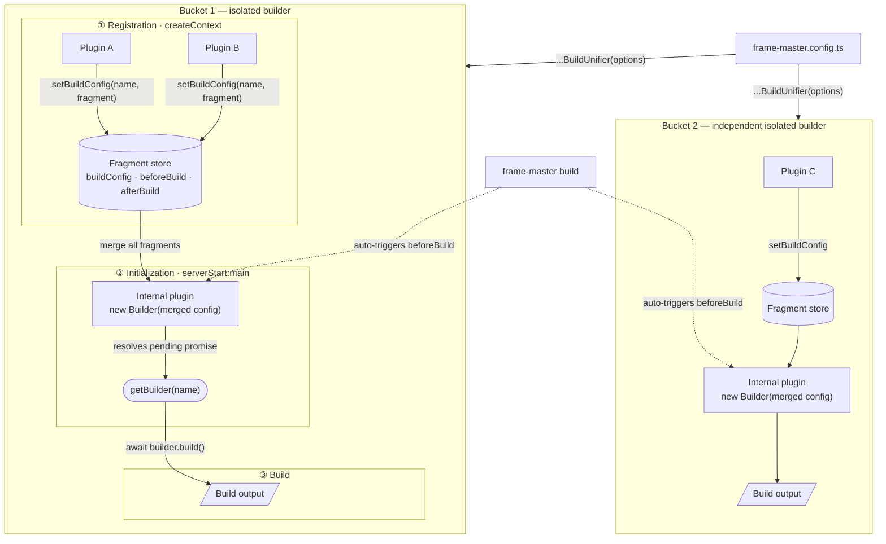

# build-unifier

> A Frame-Master plugin helper that lets multiple plugins share one isolated `Builder` instance per pipeline.

Without `build-unifier`, each plugin needs its own `Builder`, making it hard to combine build fragments (entrypoints, loaders, Bun plugins) from cooperating plugins into a single build. `build-unifier` solves this by creating one shared builder per group, fully isolated from other groups.

## Installation

```bash
bun add frame-master-plugin-build-unifier
```

## What it does

- Creates **one isolated `Builder`** per `buildunifier(...)` call (a "bucket").
- Lets every plugin in the bucket register build fragments (`buildConfig`, `beforeBuild`, `afterBuild`) via the shared global context using `setBuildConfig(pluginName, fragment)`.
- **Merges all fragments** from the same bucket into a single `Builder` instance at server start.
- Exposes the shared builder through a promise-based `getBuilder(pluginName)` API so any plugin in the bucket can await and trigger the build when ready.
- **Automatically triggers** the shared build when `frame-master build` is run (CLI mode).
- Keeps separate `buildunifier(...)` calls **fully isolated** from each other — each gets its own independent builder.

## How it works

Each `buildunifier(...)` call has three phases:

1. **Registration** — wrapped plugins call `setBuildConfig(name, fragment)` inside their `createContext` hook to register build fragments into an isolated store keyed by a unique bucket ID.
2. **Initialization** — the internal build-unifier plugin runs at `serverStart.main`, merges all registered fragments, and creates a single `Builder`. Pending `getBuilder(name)` promises are resolved at this point.
3. **Build** — any plugin in the bucket can call `await getBuilder(name)` then `builder.build()`. In CLI mode (`frame-master build`), the internal plugin auto-triggers the build via the `build.beforeBuild` hook.

## Flow



### Build fragment structure

`BuildOptionsPlugin` is the same interface used by `FrameMasterPlugin.build`. Each `setBuildConfig(pluginName, fragment)` call is equivalent to contributing one plugin's `build` block to Frame-Master's shared build pipeline:

All fragments contributed by plugins in the same bucket are passed to Frame-Master's `Builder`, which applies its standard merge rules to `buildConfig` — [Build Documentation](https://frame-master.com/docs/core/build)

## API

`buildunifier(options)` returns an **array of plugins** — it must be spread into the Frame-Master `plugins` list.

### Options

```typescript
type BuildUnifierPluginOptions = {
  plugins: FrameMasterPlugin[]; // plugins to group into this bucket
  logging?: boolean;            // enable builder verbose output (default: false)
};
```

### Global context

```typescript
declare module "frame-master/plugin/types" {
  interface GlobalPluginContextMap {
    "build-unifier": {
      setBuildConfig: (pluginName: string, config: BuildOptionsPlugin) => void;
      getBuilder: (pluginName: string) => Promise<Builder>;
    };
  }
}
```

| Method | When to call | Description |
| ------ | ------------ | ----------- |
| `setBuildConfig(name, fragment)` | `createContext` | Registers a build fragment for this plugin in the bucket's fragment store. |
| `getBuilder(name)` | any hook except `createContext` | Returns a `Promise<Builder>` that resolves once the internal plugin has merged all fragments and created the builder. |

## Usage

### Single plugin

Register a build fragment in `createContext`, then await the shared builder in `serverReady` (or `serverStart.main`) to trigger the build:

```typescript
import type { FrameMasterConfig } from "frame-master/server/types";
import { getGlobalPluginContext } from "frame-master/plugin";
import BuildUnifier from "frame-master-plugin-build-unifier";

const config: FrameMasterConfig = {
  HTTPServer: { port: 3000 },
  plugins: [
    ...BuildUnifier({
      plugins: [
        {
          name: "build-1-1",
          version: "0.1.0",
          createContext() {
            // ① Registration phase — called before serverStart
            const ctx = getGlobalPluginContext("build-unifier");
            ctx?.setBuildConfig?.("build-1-1", {
              beforeBuild() {
                console.log("build-1-1 beforeBuild");
              },
              buildConfig: {
                entrypoints: ["mock/index.ts"],
                outdir: "mock/dist/1",
              },
            });
          },
          async serverReady() {
            // ③ Build phase — builder promise resolves after serverStart.main
            const builder = await getGlobalPluginContext(
              "build-unifier",
            )?.getBuilder?.("build-1-1");

            if (builder && !builder.isBuilding()) {
              await builder.build();
            }
          },
        },
      ],
    }),
  ],
};

export default config;
```

## Multiple plugins sharing one builder

All plugins passed to the **same** `buildunifier(...)` call share one `Builder`. Each plugin registers its own fragment; the internal plugin merges them all before building.

```typescript
...BuildUnifier({
  plugins: [
    {
      name: "build-2-1",
      version: "0.1.0",
      createContext() {
        // Contributes entrypoints + outdir
        getGlobalPluginContext("build-unifier")?.setBuildConfig?.("build-2-1", {
          buildConfig: {
            entrypoints: ["mock/index.ts"],
            outdir: "mock/dist/2",
          },
        });
      },
    },
    {
      name: "build-2-2",
      version: "0.1.0",
      createContext() {
        // Contributes a beforeBuild hook only — merged with the fragment above
        getGlobalPluginContext("build-unifier")?.setBuildConfig?.("build-2-2", {
          beforeBuild() {
            console.log("build-2-2 beforeBuild");
          },
        });
      },
      async serverReady() {
        // Either plugin can trigger the shared builder
        const builder = await getGlobalPluginContext(
          "build-unifier",
        )?.getBuilder?.("build-2-2");

        if (builder && !builder.isBuilding()) {
          await builder.build();
        }
      },
    },
  ],
})
```

`build-2-1` and `build-2-2` both contribute to the same `Builder` instance. The resulting build combines their `buildConfig`, `beforeBuild`, and `afterBuild` entries.

## Multiple `buildunifier(...)` instances

Each `buildunifier(...)` call creates a **completely independent builder bucket**. Use this to isolate unrelated build pipelines in the same Frame-Master config:

```typescript
plugins: [
  // Pipeline A — shares one builder between plugin-a-1 and plugin-a-2
  ...BuildUnifier({ plugins: [pluginA1, pluginA2] }),

  // Pipeline B — separate builder, fully isolated from pipeline A
  ...BuildUnifier({ plugins: [pluginB1] }),
]
```

## Notes

- **Call `setBuildConfig` from `createContext`** — this hook runs before `serverStart`, ensuring fragments are registered before the internal plugin initializes the builder.
- **Use the exact plugin name** — `setBuildConfig(pluginName, ...)` and `getBuilder(pluginName)` both key off the plugin's `name` field as declared in the `plugins` array passed to `buildunifier(...)`.
- **`getBuilder` is promise-based** — it resolves once `serverStart.main` completes. It can be called from any hook except `createContext` (which runs before the builder is initialized). Awaiting it from any later hook is safe — it will simply wait until the builder is ready.
- **CLI builds are automatic** — when running `frame-master build`, the internal plugin triggers `builder.build()` automatically via `build.beforeBuild`. You do not need to call it manually in that path.
- **Plugin names must be unique** across all `buildunifier(...)` calls, because the global context keys builders by plugin name.
- **`isBuilding()` guard** — check `builder.isBuilding()` before calling `builder.build()` to avoid triggering concurrent builds when multiple plugins in the same bucket all reach `serverReady`.

## License

MIT
